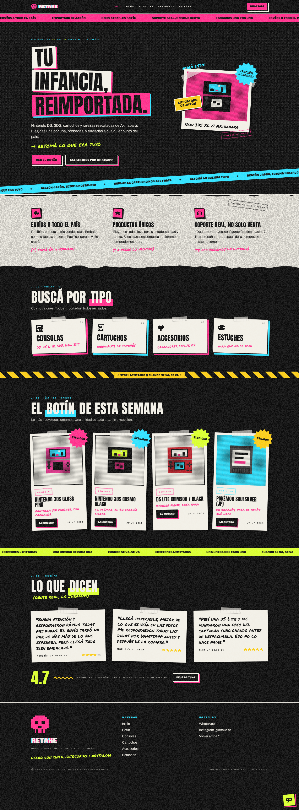

# Retake

**Retomá lo que era tuyo.** Tienda de consolas Nintendo DS y 3DS, cartuchos, accesorios y estuches usados, importados de Japón. La venta se cierra por WhatsApp: no hay carrito ni checkout. El sitio muestra el catálogo con estética de zine fotocopiado (collage, tintas planas, glitch en pulsos) y tiene un backoffice simple para cargar productos y fotos.



## Qué incluye

- **Sitio público:** home con "El botín de esta semana", ediciones limitadas y reseñas; catálogo con filtros por categoría y búsqueda; ficha de producto con galería y botón de WhatsApp con el mensaje armado; 404 con onda.
- **Backoffice en `/admin`:** login con contraseña, panel con conteos, alta/baja/modificación de productos, subida de hasta 8 fotos por producto (se convierten a WebP y se generan miniaturas), reorden y borrado de fotos, estados Disponible / Reservada / Vendida.
- **Base de datos SQLite** en un archivo local. Sin servicios externos para desarrollar. En producción puede ser el mismo archivo en un VPS o Turso.

## Requisitos

- Node 22 o superior.
- pnpm 12 (`npm install -g pnpm` o `corepack enable`).

## Arranque en cinco comandos

```bash
pnpm install
cp .env.example .env.local      # editá ADMIN_PASSWORD y SESSION_SECRET
pnpm db:setup                   # crea data/retake.db y carga 4 productos de ejemplo
pnpm dev
```

Abrí http://localhost:3000 para el sitio y http://localhost:3000/admin/login para el backoffice.

Para generar el `SESSION_SECRET`:

```bash
openssl rand -hex 32
```

## Variables de entorno

Todas viven en `.env.local` (ignorado por git). `.env.example` es la plantilla.

| Variable                      | Qué es                                                               | Ejemplo                                                  |
| ----------------------------- | -------------------------------------------------------------------- | -------------------------------------------------------- |
| `DATABASE_URL`                | Dónde está la base. Archivo local o Turso.                           | `file:./data/retake.db` o `libsql://retake-xxx.turso.io` |
| `DATABASE_AUTH_TOKEN`         | Token de Turso. Vacío si usás archivo local.                         |                                                          |
| `ADMIN_PASSWORD`              | Contraseña del backoffice. Mínimo 8 caracteres.                      |                                                          |
| `SESSION_SECRET`              | Firma la cookie de sesión. Mínimo 32 caracteres.                     | salida de `openssl rand -hex 32`                         |
| `UPLOADS_DIR`                 | Carpeta donde se guardan las fotos procesadas.                       | `data/uploads`                                           |
| `NEXT_PUBLIC_SITE_URL`        | URL pública del sitio. Se usa en los links de WhatsApp y el sitemap. | `https://retake.ar`                                      |
| `NEXT_PUBLIC_WHATSAPP_NUMBER` | Número con código de país, solo dígitos.                             | `5491155551234`                                          |
| `NEXT_PUBLIC_INSTAGRAM`       | Usuario de Instagram sin arroba.                                     | `retake.ar`                                              |

Si falta algo o está mal, el servidor no arranca y te dice qué variable es.

## Cómo usar el backoffice

1. **Entrar:** `/admin/login` con la contraseña de `ADMIN_PASSWORD`. La sesión dura 7 días. Después de cinco intentos fallidos seguidos, el login se bloquea quince minutos.
2. **Crear un producto:** Productos → Nuevo. Nombre, categoría y precio son obligatorios. El slug se arma solo desde el nombre y podés tocarlo. La "nota corta" es la frase a mano que aparece en la tarjeta ("pantalla sin rayones, con cargador").
3. **Fotos:** se cargan después de guardar, desde la ficha del producto. Hasta 8, de 8 MB cada una, en JPG, PNG o WebP. La primera es la principal. Podés reordenar con las flechas y borrar.
4. **Estados:** Disponible se muestra normal. Reservada lleva un sello. Vendida se va al final del catálogo con el sello VENDIDA y desaparece de la home.
5. **Destacado:** el producto destacado más reciente ocupa la polaroid del hero.
6. **Edición limitada:** aparece también en la sección "Ediciones limitadas" de la home.
7. **Orden:** número opcional. Mayor va primero. Empate: el más nuevo primero.
8. **Borrar:** desde la ficha, al final. Borra también las fotos del disco. No hay papelera.

## Comandos

| Comando                     | Qué hace                                                                                            |
| --------------------------- | --------------------------------------------------------------------------------------------------- |
| `pnpm dev`                  | Servidor de desarrollo con recarga.                                                                 |
| `pnpm build` y `pnpm start` | Build y servidor de producción.                                                                     |
| `pnpm check`                | Lint, tipos, tests y build. Lo que tiene que pasar antes de subir cambios.                          |
| `pnpm test`                 | Solo los tests (Vitest, menos de 2 segundos).                                                       |
| `pnpm db:migrate`           | Aplica las migraciones de `drizzle/` a la base de `DATABASE_URL`.                                   |
| `pnpm db:seed`              | Carga los 4 productos de ejemplo si la base está vacía. Con `--reset` borra todo y vuelve a cargar. |
| `pnpm db:generate`          | Genera una migración nueva después de cambiar `src/lib/db/schema.ts`.                               |
| `pnpm format`               | Prettier sobre todo el repo.                                                                        |

## Deploy

### Opción A: un VPS o Docker con el archivo SQLite

La más simple y la que recomendamos para una tienda de este tamaño.

1. Cloná el repo en el servidor, `pnpm install`, `.env.local` con tus valores y `NEXT_PUBLIC_SITE_URL` con tu dominio.
2. `pnpm db:migrate` y, si querés, `pnpm db:seed`.
3. `pnpm build` y `pnpm start -p 3000`. Dejalo corriendo con systemd o pm2.
4. Poné Caddy o nginx adelante con HTTPS.
5. La carpeta `data/` tiene la base y las fotos. **Es lo único que hay que respaldar y persistir.**

### Opción B: Vercel + Turso

1. Creá una base en Turso y copiá la URL `libsql://...` y el token.
2. En Vercel cargá todas las variables de la tabla de arriba con esos valores.
3. Desde tu máquina, con un `.env.local` apuntando a Turso, corré `pnpm db:migrate`.
4. Deployá.

**Limitación importante:** en Vercel el disco es efímero y cada request admite 4,5 MB como máximo. Las fotos subidas desde el admin se pierden en el próximo deploy. Antes de usar Vercel en serio hay que implementar un `Storage` en Cloudinary o Vercel Blob (ver roadmap). La interfaz ya está preparada en `src/lib/storage/`.

## Backups

Copiá `data/retake.db` y `data/uploads/`. Eso es todo el estado de la tienda. Un `tar` diario a otro lado alcanza.

## Estructura

```
src/app/(site)/        páginas públicas: home, /botin, /botin/[slug]
src/app/admin/         backoffice: login y panel
src/app/uploads/       sirve las fotos desde data/uploads
src/components/ui/     piezas del diseño: Cut, Polaroid, Burst, Stamp, Marquee...
src/components/site/   secciones del sitio público
src/components/admin/  formularios y tablas del backoffice
src/lib/               base de datos, productos, auth, storage, utils
src/content/           reseñas estáticas (reviews.json)
drizzle/               migraciones generadas
scripts/               migrate y seed
tests/                 Vitest
design/                mockup original y capturas
docs/                  plan de implementación
```

Para el diseño leé `DESIGN.md`. Para trabajar con Claude Code leé `CLAUDE.md`.

## Roadmap

- Reseñas con moderación desde el admin. Hoy son estáticas en `src/content/reviews.json`.
- Storage en Cloudinary o Vercel Blob para poder deployar en Vercel con fotos.
- Varios usuarios admin y límite de intentos de login.
- Búsqueda que ignore acentos.
- Imagen de OpenGraph generada con la estética del zine.

## Créditos

Diseño inspirado en la estética DedSec de Watch Dogs 2, hecho desde cero: no se usa ningún logo ni material de Ubisoft. No afiliados a Nintendo. Ni a nadie.

Hecho por Juan Bulla con Claude Code, con cinta, fotocopias y nostalgia.
